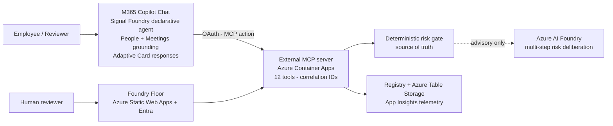

# Signal Foundry


Signal Foundry turns raw work signals and employee AI ideas into governed, risk-reviewed, human-approved, reusable Copilot workflows.

Brand promise: `Raw Signals | Forged with Intelligence | Approved Workflows`

Demo default: fictional company `Asteria Dynamics`, tenant `tenant-asteria-dynamics`, project `revenue-ops-launchpad`.

## Live Demo

- Foundry Floor: `https://red-coast-0b0c14e0f.7.azurestaticapps.net`
- MCP/API: `https://ca-signal-foundry-mcp.agreeablemushroom-5fb088be.eastus2.azurecontainerapps.io`
- Evidence summary: `evidence/azure/deployed-smoke-results.md`

## For Judges

Start with [docs/submission/JUDGE-GUIDE.md](docs/submission/JUDGE-GUIDE.md) —
60-second orientation, live URLs, local quickstart, and what to look for.
Architecture: [docs/submission/architecture.md](docs/submission/architecture.md).



## Local Development

```bash
npm --prefix /Users/mattgraves/Development/hackathon-enterprise install
npm --prefix /Users/mattgraves/Development/hackathon-enterprise run validate
npm --prefix /Users/mattgraves/Development/hackathon-enterprise run dev:all
```

Local endpoints:

- MCP/API: `http://127.0.0.1:7071`
- Foundry Floor: `http://127.0.0.1:5173`

## Local Container

```bash
npm --prefix /Users/mattgraves/Development/hackathon-enterprise run container:build
npm --prefix /Users/mattgraves/Development/hackathon-enterprise run container:run
npm --prefix /Users/mattgraves/Development/hackathon-enterprise run smoke:local
```

## Azure Deployment

```bash
bash /Users/mattgraves/Development/hackathon-enterprise/scripts/deploy.sh --plan
bash /Users/mattgraves/Development/hackathon-enterprise/scripts/deploy.sh --what-if
bash /Users/mattgraves/Development/hackathon-enterprise/scripts/deploy.sh --apply --build-image --deploy-static
```

Before `--apply`, declare the blast radius and rollback path. The target resource group is `rg-signal-foundry-hackathon` in subscription `YOUR-AZURE-SUBSCRIPTION-ID`.

## Advisory Reasoning + Work IQ Grounding

An Azure AI Foundry model produces an advisory multi-step risk deliberation for every scored proposal; the deterministic risk gate remains the source of truth and visibly arbitrates any disagreement in the Risk Gate panel. Work IQ-style grounding flows through the Copilot surface as permission-aware summaries only — the MCP server never receives raw Microsoft 365 content. Advisory mode degrades gracefully (`SIGNAL_FOUNDRY_ADVISORY_MODE=off`), so the golden demo never depends on a live model endpoint.

## Safety

- Synthetic enterprise data only by default.
- No raw Microsoft 365 content, secrets, tokens, PII, stack traces, or production data in UI, logs, screenshots, release packets, or evidence.
- Human review is required before release.
- Deterministic risk scoring is the source of truth; optional LLM output is advisory only.
