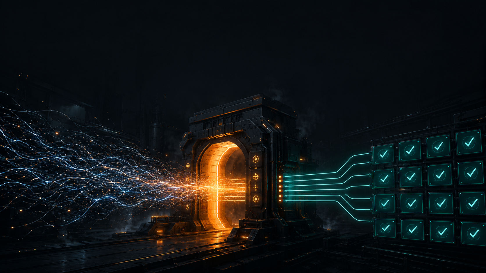
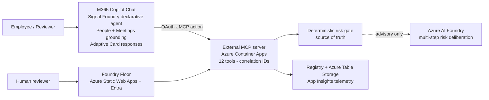

# Signal Foundry



Signal Foundry turns raw work signals and employee AI ideas into governed, risk-reviewed, human-approved, reusable Copilot workflows.

Brand promise: `Raw Signals | Forged with Intelligence | Approved Workflows`

Demo default: fictional company `Asteria Dynamics`, tenant `tenant-asteria-dynamics`, project `revenue-ops-launchpad`.

## Live Demo

- **Demo video (3 min):** https://youtu.be/HMQTQHJM9vQ
- Foundry Floor: `https://red-coast-0b0c14e0f.7.azurestaticapps.net`
  - Demo login (pre-filled): `alex.kim@asteriadynamics.com` / `signal-foundry-2026` → **Launch Console**
- Evidence summary: `evidence/azure/deployed-smoke-results.md`

## For Judges

Start with [docs/submission/DEMO-GUIDE.md](docs/submission/DEMO-GUIDE.md) —
60-second orientation, live URLs, local quickstart, and what to look for.
Architecture: [docs/submission/architecture.md](docs/submission/architecture.md).
Install and sideload guide: [docs/submission/INSTALL.md](docs/submission/INSTALL.md).
Live Copilot checkpoint spec: [docs/submission/live-copilot-checkpoints-spec.md](docs/submission/live-copilot-checkpoints-spec.md).



## Local Development

```bash
npm --prefix . install
npm --prefix . run validate
npm --prefix . run dev:all
```

Local endpoints:

- MCP/API: `http://127.0.0.1:7071`
- Foundry Floor: `http://127.0.0.1:5173`

## Local Container

```bash
npm --prefix . run container:build
npm --prefix . run container:run
npm --prefix . run smoke:local
```

## Azure Deployment

To deploy your own instance, copy the parameters template and set your subscription:

```bash
cp infra/main.parameters.example.json infra/main.parameters.json   # then edit the resource names
export SIGNAL_FOUNDRY_AZURE_SUBSCRIPTION_ID=<your-subscription-id>  # never committed
bash ./scripts/deploy.sh --plan
bash ./scripts/deploy.sh --what-if
bash ./scripts/deploy.sh --apply --build-image --deploy-static
```

All resource names are Bicep parameters with defaults; override them in `infra/main.parameters.json` or via `SIGNAL_FOUNDRY_AZURE_*` env vars in `scripts/deploy.sh`. Before `--apply`, declare the blast radius and rollback path. The committed defaults target resource group `rg-signal-foundry-hackathon`; the subscription ID is supplied only through the env var above.

## Advisory Reasoning + Work IQ Grounding

An Azure AI Foundry model produces an advisory multi-step risk deliberation for every scored proposal; the deterministic risk gate remains the source of truth and visibly arbitrates any disagreement in the Risk Gate panel. Work IQ-style grounding flows through the Copilot surface as permission-aware summaries only — the MCP server never receives raw Microsoft 365 content. Advisory mode degrades gracefully (`SIGNAL_FOUNDRY_ADVISORY_MODE=off`), so the golden demo never depends on a live model endpoint.

## Safety

- Synthetic enterprise data only by default.
- No raw Microsoft 365 content, secrets, tokens, PII, stack traces, or production data in UI, logs, screenshots, release packets, or evidence.
- Human review is required before release.
- Deterministic risk scoring is the source of truth; optional LLM output is advisory only.
