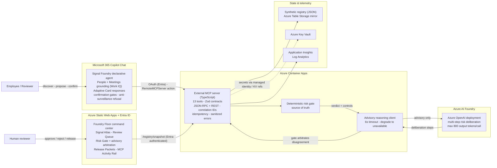

# Signal Foundry Architecture

## Trust boundaries

1. **Copilot surface → MCP server:** OAuth via Entra; only schema-validated,
   length-capped summary fields cross. Raw Microsoft 365 content stays inside
   the Copilot grounding boundary.
2. **Deterministic gate → advisory model:** the model receives only the
   proposal's synthetic fields and the gate's verdict; its output is sanitized,
   capped, and can never change a deterministic outcome (test-enforced).
3. **Release boundary:** no capability reaches `released` without an explicit
   reviewer approval recorded with a correlation ID.

## Verification

`npm run validate` chains OpenSpec strict validation, typecheck, unit and
integration tests, the judge-evidence validator, the Copilot package validator
(hash-pinned v0.1.7), the Work IQ + Foundry readiness gate, and the Adaptive
Card check. `npm run test:e2e` runs the Playwright golden flow against a freshly
reset local stack.
