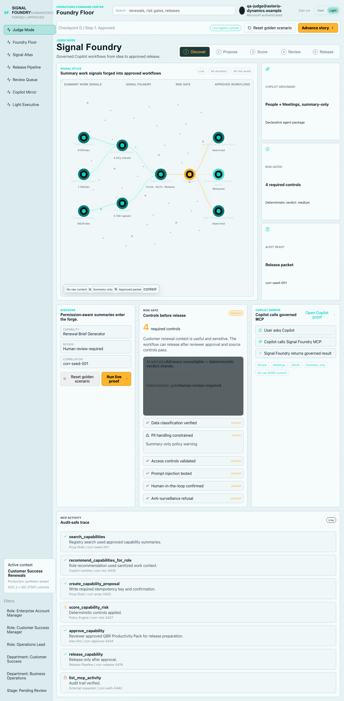
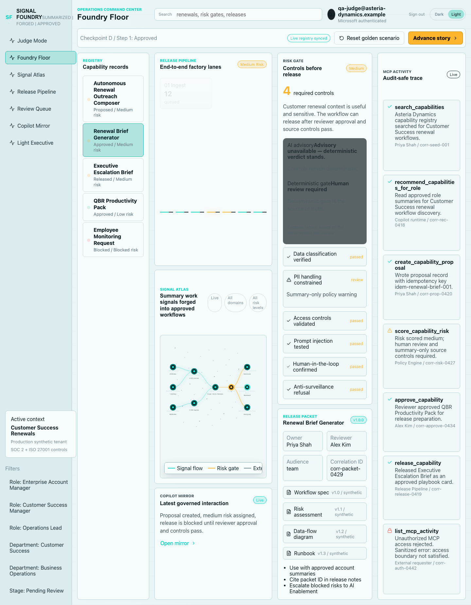
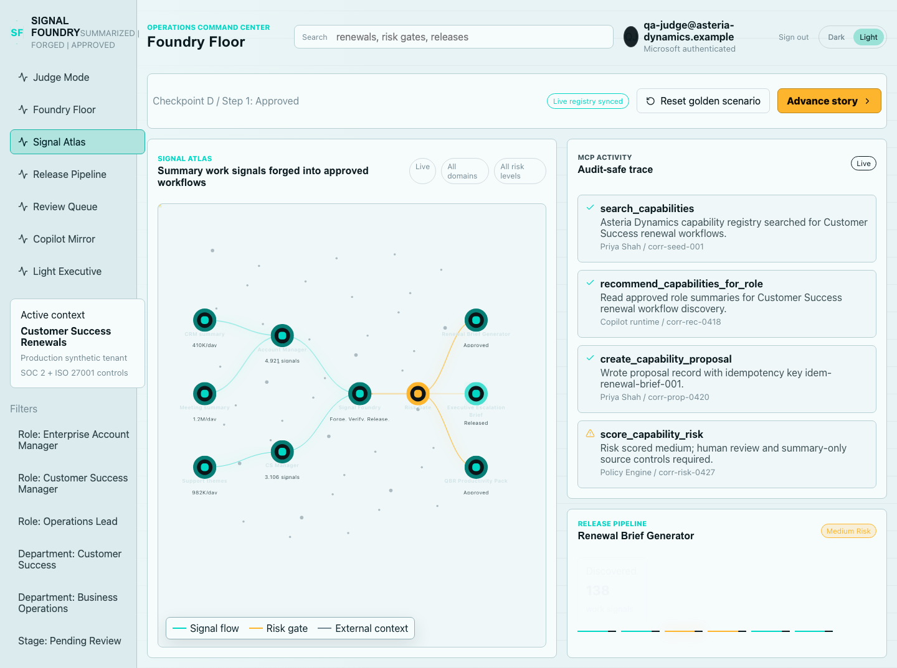
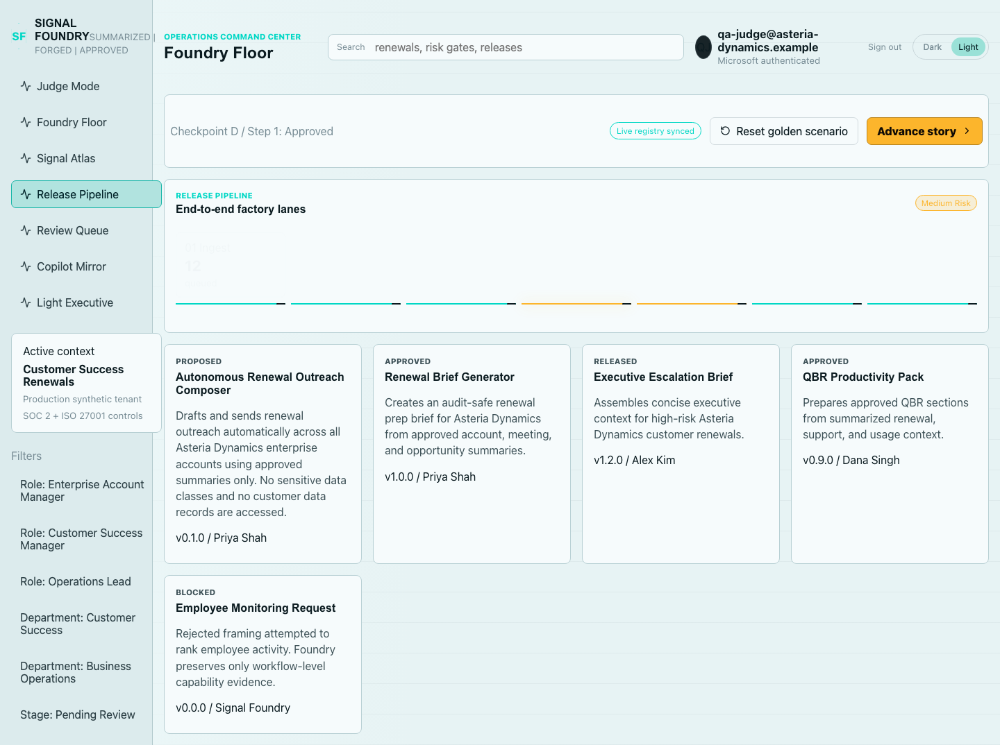
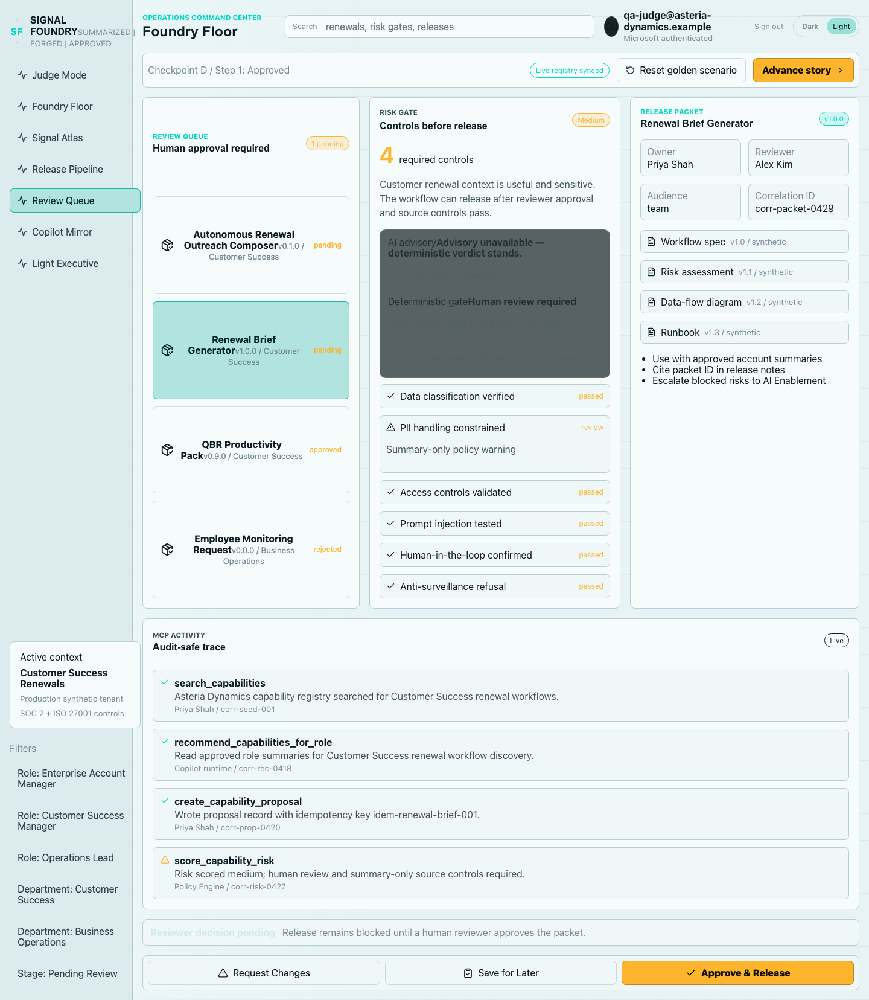
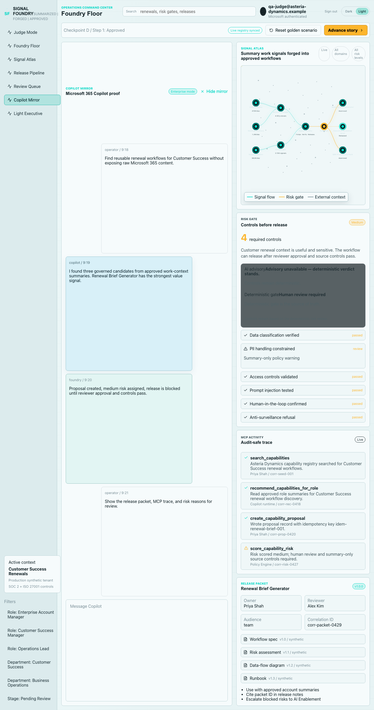
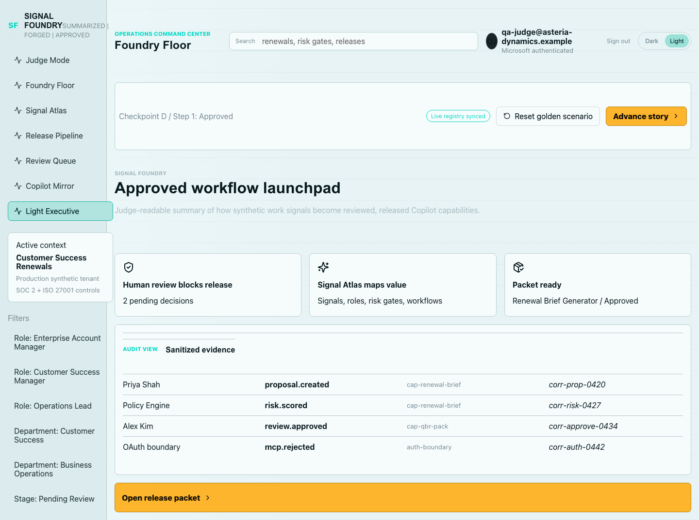
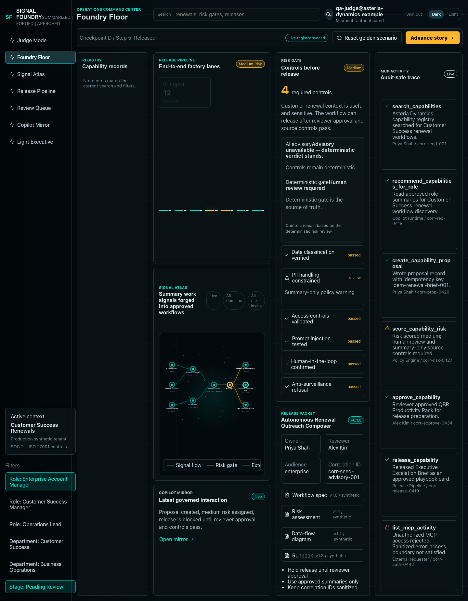
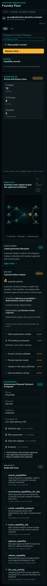
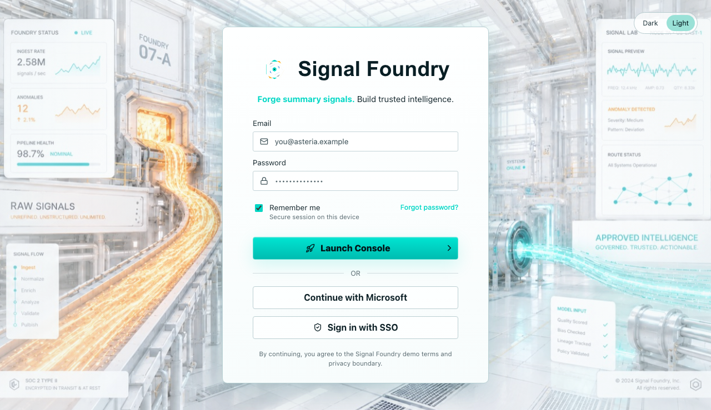

# Signal Foundry Solution Walkthrough

This document explains how the built Signal Foundry solution works, using
Playwright screenshots captured from the implemented Foundry Floor portal.

Screenshots were generated by the Playwright portal QA sweep against the local
MCP + Foundry Floor stack with synthetic authenticated user data. The sweep
exercises the screens, navigation, controls, links, theme switch, reduced-motion
behavior, and mobile layout.

## What Signal Foundry Does

Signal Foundry turns raw work-context signals and employee AI ideas into
governed, risk-reviewed, human-approved Copilot workflows.

The core flow is:

1. A user discovers or proposes a workflow from Microsoft 365 Copilot Chat.
2. The Copilot declarative agent calls the external MCP server.
3. The MCP server validates input with typed contracts, applies deterministic
   risk gates, records correlation IDs, and stores sanitized registry events.
4. Azure AI Foundry / Azure OpenAI can provide advisory reasoning when
   configured, but the deterministic risk gate remains authoritative.
5. A human reviewer approves or blocks release.
6. Foundry Floor visualizes the registry, risk gate, Signal Atlas, release
   packet, Copilot proof, and MCP activity trail.

The submission-safe Work IQ claim is permission-aware Work IQ-style grounding
through Microsoft 365 Copilot People and Meetings context. The MCP server does
not ingest raw emails, chats, files, transcripts, or private Microsoft Graph
content.

## Architecture At A Glance

The built solution includes:

- Microsoft 365 Copilot declarative agent with People and Meetings grounding.
- External TypeScript MCP/API server on Azure Container Apps.
- Deterministic risk gate with human-in-the-loop release control.
- Optional Azure AI Foundry / Azure OpenAI advisory reasoning.
- Azure Static Web Apps Foundry Floor portal with Entra authentication.
- Azure Table Storage mirror, Key Vault configuration, Application Insights,
  and Log Analytics telemetry.
- React + Vite frontend with Vitest and Playwright validation.

The important trust boundary is that Copilot can use permission-aware work
context, but only sanitized, length-capped summary fields cross into the MCP
server. The portal screenshots below use synthetic tenant data.

## 1. Judge Mode

Judge Mode is the main demo surface. It shows the complete governed workflow
story in one place: stage progression, Signal Atlas, proof cards, risk controls,
and evidence that the workflow cannot release without approval.



What to look for:

- The stage stepper walks through Discover, Propose, Score, Review, and Release.
- The Signal Atlas maps work signals, roles, risk gates, and approved workflows.
- Proof cards summarize the core claims: human review blocks release, the atlas
  maps value, and the release packet is ready.
- The risk comparison section shows that advisory reasoning is separate from the
  deterministic gate.

## 2. Foundry Floor

Foundry Floor is the operations command center. It shows the registry, current
release pipeline, risk gate, release packet, Signal Atlas preview, Copilot
Mirror preview, and MCP activity rail.



What to look for:

- Capability records are grouped by status and risk.
- Filters narrow records by role, department, and stage.
- The risk gate lists required controls before release.
- The release packet includes owner, reviewer, audience, version, artifacts, and
  correlation ID.
- MCP Activity shows sanitized tool events and rejected unauthorized access.

## 3. Signal Atlas

Signal Atlas visualizes how work signals become governed workflows. It is the
visual proof that Signal Foundry is a registry and governance layer, not only a
chatbot.



What to look for:

- Signal flow edges connect work context to reviewed workflow outputs.
- Amber risk-gate paths show where governance intervenes.
- Teal released nodes show approved workflow outcomes.
- The visualization supports the story that the system forges raw signals into
  approved, reusable capabilities.

## 4. Release Pipeline

The Release Pipeline shows the deterministic path from ingest to released
capability. It makes the release controls concrete for judges and reviewers.



What to look for:

- Pipeline stages represent ingest, process, enrich, review, approve, and
  release.
- Risk level stays visible while records move through the factory lanes.
- The view emphasizes that release is gated, not automatic.

## 5. Review Queue

Review Queue is the human approval surface. It lets reviewers inspect evidence,
save for later, request changes, approve, and release.



What to look for:

- Review decisions are explicit user actions.
- Save for Later and Request Changes update visible state.
- Approve & Release routes the workflow back to the governed release path.
- Unauthorized approval is covered by the Playwright golden flow and server
  tests.

## 6. Copilot Mirror

Copilot Mirror shows the Microsoft 365 Copilot proof surface. It demonstrates
how a Copilot conversation maps to registry events, risk controls, Signal Atlas,
MCP activity, and release packet evidence.



What to look for:

- Operator prompts ask for reusable workflows without exposing raw Microsoft 365
  content.
- Copilot responses are rendered as a readable light-blue response surface.
- Foundry responses are visually distinct and summarize risk and review state.
- The right rail shows the same evidence surfaces: Signal Atlas, Risk Gate, MCP
  Activity, and Release Packet.

## 7. Light Executive View

Light Executive is the screen-share-friendly summary. It gives judges and
executives the outcome without requiring them to inspect the whole operations
console.



What to look for:

- The headline frames the product as an approved workflow launchpad.
- Summary cards explain the review block, Signal Atlas value, and packet state.
- Sanitized evidence rows show actor, event, capability, and correlation ID.
- The Open release packet action routes back into the governed review evidence.

## 8. Exercised Controls

The Playwright sweep also exercises controls after navigation: stage buttons,
search, filters, review decisions, theme switch, Copilot proof open/close, links,
animation visibility, and reduced-motion behavior.



The mobile screenshot verifies that the portal remains usable at a narrow
viewport with reduced motion enabled.



The signed-out screenshot verifies the access gate and Microsoft sign-in surface
remain usable without dead links.



## End-To-End Demo Path

Use this path when explaining the built solution:

1. Open Foundry Floor.
2. Start in Judge Mode and run the golden scenario.
3. Explain that Copilot proposes a workflow from approved work-context
   summaries.
4. Open Copilot Mirror to show the governed Copilot interaction and the
   blue Copilot response surface.
5. Open Signal Atlas to show raw signals, risk gate, and approved workflows.
6. Open Review Queue to show human approval.
7. Open Release Pipeline to show the workflow moving through release stages.
8. Open Light Executive for a judge-readable summary and release packet entry.
9. Point to the MCP Activity rail for correlation IDs and sanitized audit events.
10. Explain that the deterministic risk gate is the source of truth; Azure AI
    Foundry advisory reasoning is visible when configured, but cannot override
    the gate.

## Playwright Evidence

The screenshot set was generated with:

```bash
SIGNAL_FOUNDRY_EVIDENCE_DIR=/Users/mattgraves/Development/hackathon-enterprise/docs/submission/foundry-solution-walkthrough/screenshots npm --prefix /Users/mattgraves/Development/hackathon-enterprise run test:e2e -- /Users/mattgraves/Development/hackathon-enterprise/tests/e2e/portal-qa-sweep.spec.ts
```

The run passed:

- `portal QA sweep covers screens, controls, links, motion, and evidence`
- `locked and signed-out portal states expose usable actions without dead links`

The generated sweep summary is stored at
[walkthrough-summary.md](foundry-solution-walkthrough/screenshots/walkthrough-summary.md).

## What This Proves

- The solution is Copilot-first, but the portal visualizes the governed outcome.
- Work IQ-style grounding is constrained to permission-aware summaries.
- The MCP server preserves sanitized events and correlation IDs.
- Risk scoring is deterministic and human review blocks release.
- Azure AI Foundry advisory reasoning is a guardrailed support layer, not the
  release authority.
- The UI has been exercised across main screens, controls, links, animation
  state, signed-out state, and mobile layout by Playwright.
