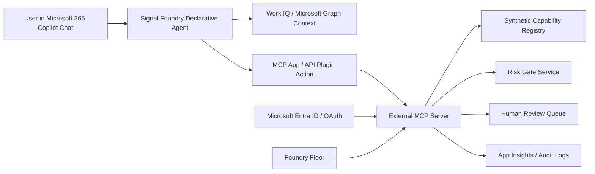

# Design: Signal Foundry

## Product Definition

Signal Foundry is a Microsoft 365 Copilot Chat agent plus external MCP-backed registry that helps employees discover useful Copilot capabilities and helps organizations govern which capabilities are approved for reuse.

Brand promise:

> Raw Signals | Forged with Intelligence | Approved Workflows

The core product loop is:

1. Discover role-relevant AI use cases in Copilot Chat.
2. Convert a selected use case into a capability proposal.
3. Score the proposal through an AI Capability Risk Gate.
4. Route the proposal for human approval.
5. Release the approved capability as a reusable playbook card.
6. Visualize the pipeline in the Foundry Floor command center.

## Brand System

Use the provided Signal Foundry logo and brand reference:

- Logo concept: raw signal traces enter a hexagonal forge/anvil mark and exit as approved workflow tiles.
- Palette: Graphite `#1C1F23`, Warm Steel `#7C848E`, Electric Teal `#00D1C2`, Amber `#FFB12E`.
- Visual language: signal streams, forge gates, approved workflow tiles, release stamps, risk heat, and capability constellations.
- Tone: industrial precision, executive trust, and applied intelligence.
- Anti-patterns: generic AI robots, stock neural networks, glassy cards, decorative glow, bland metric-card dashboards, and gratuitous gradients.

## Recommended Runtime Path

Use a Microsoft 365 Copilot Chat Declarative Agent as the first implementation path. Declarative agents keep the required hackathon surface inside Copilot Chat, use Copilot's hosted orchestrator, and support custom actions through REST APIs or MCP-backed plugins.

Use a Custom Engine Agent only if the tenant cannot support the required MCP action path or if the demo needs orchestration that a declarative agent cannot reliably perform.

## Microsoft Build 2026 Overlap Positioning

Recent Microsoft Build announcements create overlap risk if the product is framed as a general agent store, autonomous worker, or Work IQ context demo. The product SHALL be positioned as a governed use-case-to-release workflow, not as:

- a replacement for Microsoft Scout,
- an always-on personal assistant,
- a replacement for Agent Store / Agent 365 governance,
- a generic Work IQ data explorer,
- or a compliance scanner.

The differentiator is the full release loop: employee idea -> proposal -> risk gate -> approval -> reusable Copilot capability -> audit-safe command center evidence.

## Component Architecture

## Frontend Component

The frontend is a judge-facing and reviewer-facing Foundry Floor. It does not replace Microsoft 365 Copilot Chat. It visualizes the system of record and demonstrates that Copilot Chat actions produced governed backend state.

Frontend modules:

- Signal Atlas: graph or constellation view of raw signals, capabilities, roles, departments, owners, risk gates, and release state.
- Release Pipeline: lane-based view for Discovered, Proposed, Risk Scored, In Review, Approved, Released, and Blocked.
- Risk Gate Panel: evidence-safe review of data sensitivity, automation risk, external sharing risk, policy notes, and required human review.
- Release Packet Drawer: capability summary, prompt/playbook shape, approved sources, owner, reviewer, version, and audit ID.
- MCP Activity Rail: read/write operations, authorization status, correlation IDs, and sanitized errors.
- Copilot Mirror: scripted representation of the Copilot Chat interaction for the demo.

Frontend constraints:

- Must not present raw emails, chats, transcripts, documents, secrets, tokens, or PII.
- Must avoid generic AI dashboards, stock-like visuals, icon-card grids, decorative gradient orbs, glassmorphism, and bland metric walls.
- Must make the Signal Atlas or Release Pipeline the memorable visual artifact.
- Must show empty, loading, proposed, risk scored, pending review, approved, rejected, unauthorized, and released states.
- Must use stable dimensions for pipeline lanes, graph nodes, review controls, and activity rows.

Recommended frontend stack:

- React + TypeScript.
- Vite for hackathon speed unless the final Microsoft 365 app scaffold requires another tool.
- Fluent UI v9 for Microsoft-native controls where appropriate.
- React Flow or Cytoscape.js for the Signal Atlas.
- TanStack Table for dense registry tables only when needed.
- Zod for schema validation against MCP responses.
- Playwright for visual verification.

## Backend Component: Copilot Agent

The agent lives in Microsoft 365 Copilot Chat and SHALL handle:

- Role-based capability discovery.
- Capability proposal drafting.
- Risk explanation.
- Human confirmation before MCP writes.
- Reviewer workflows for approval, rejection, and release.
- Permission-aware summaries that do not reveal inaccessible content.

Prompt boundaries:

- The agent must never monitor employee activity or score worker productivity.
- The agent must treat Work IQ context as permission-aware grounding, not surveillance.
- The agent must ask for confirmation before mutation tools.
- The agent must disclose uncertainty and recommend human review for high-risk capabilities.

## Backend Component: External MCP Server

The MCP server exposes tools for registry and workflow operations:

- `search_capabilities`
- `recommend_capabilities_for_role`
- `create_capability_proposal`
- `score_capability_risk`
- `submit_capability_review`
- `approve_capability`
- `reject_capability`
- `release_capability`
- `generate_release_packet`
- `generate_capability_map`
- `list_mcp_activity`

All write tools require authenticated user context, tenant/project scope, input validation, idempotency keys, and correlation IDs.

## Backend Component: Capability Registry Store

Use SQLite or JSON-backed synthetic data for the hackathon demo. The store contains:

- capabilities,
- proposals,
- risk reviews,
- release packets,
- approval decisions,
- audit events,
- roles,
- departments,
- synthetic approved source types.

The registry stores summaries and metadata only. It SHALL NOT store raw Microsoft 365 source content.

## Backend Component: Risk Gate Service

The Risk Gate evaluates every proposed capability across:

- data sensitivity,
- external sharing risk,
- automation level,
- audience scope,
- required human review,
- policy notes,
- prompt injection exposure,
- release readiness.

Risk scoring can be deterministic for the hackathon MVP. Optional Azure AI Foundry / Azure OpenAI can be used for deeper risk rationale if time allows and Microsoft-centered runtime dependencies remain clear.

## Backend Component: Review And Release Workflow

The review workflow supports:

- submit for review,
- request changes,
- approve,
- reject,
- release,
- suspend released capability,
- create new version.

Every approval or release writes an audit event with actor, tenant, action, target record, timestamp, and correlation ID.

## Backend Component: Auth, Authorization, And Observability

Use Microsoft Entra ID / OAuth-compatible authentication for MCP access where supported by the Copilot MCP path.

Controls:

- tenant-scoped records,
- user-scoped actions,
- reviewer role for approvals,
- no raw content in logs,
- redacted authorization failures,
- correlation IDs across Copilot action, MCP request, registry write, frontend update, and log entry.

## MVP Demo Scenario

Use customer success / account management as the demo space.

Demo prompt:

> I manage enterprise renewals. What Copilot capabilities could help me reduce renewal risk this week?

Agent recommends:

- Renewal brief generator.
- Customer meeting prep packet.
- Executive escalation brief.
- Follow-up action composer.
- Account risk summary.

The user selects Renewal brief generator. The agent creates a proposal, scores risk, routes approval, and releases the capability after reviewer approval. The Foundry Floor shows the full pipeline and MCP audit activity.

## Evidence For Judges

The repository should include:

- Copilot agent manifest and instructions.
- MCP tool definitions and schemas.
- Synthetic registry seed data.
- OAuth/auth notes and unauthorized demo.
- Screenshots of Copilot Chat flow.
- Screenshots of the Foundry Floor.
- Demo script with expected MCP calls.
- Build overlap review explaining how the product avoids duplicating Scout, Agent Store, or Agent 365.

## Execution Quality Bar

The implementation SHALL follow:

- `execution-plan.md` for P0, P1, and P2 sequencing.
- `model-task-matrix.md` for runtime agent roles, temperature guidance, and reasoning depth.
- `acceptance-rubric.md` for judge-ready pass/fail gates.
- `build-prompt-source.md` as the source material for a 9.8+ implementation prompt.
- `hackathon-sizing.md` for team split, timeboxes, and cut-line decisions.
- `architecture-cost-plan.md` for Azure service cost posture, budget guardrails, and cleanup requirements.

P0 scope must be stable before P1 polish is accepted. P2 stretch items must not block submission.
