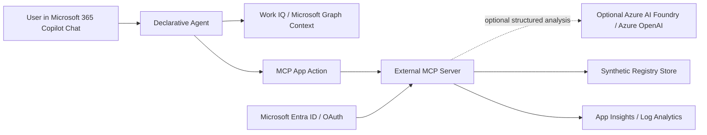

# Design: Decision & Alignment Agent

## Recommended Runtime Path

Use a Declarative Agent as the primary implementation. This keeps the agent inside Microsoft 365 Copilot Chat, uses Copilot's hosted orchestrator/model path, and avoids unnecessary custom model hosting for the first submission.

Use a Custom Engine Agent only if the demo requires deeper multi-step contradiction detection than declarative instructions plus MCP tools can support.

## User Experience

The agent is presented as a single centralized corporate agent:

> Decision & Alignment Agent

Users interact through Microsoft 365 Copilot Chat. The agent is tenant-wide in concept, but every response is scoped to the user's Microsoft 365 permissions and the MCP server's authorization rules.

Primary workflows:

1. Find decision debt across recent meetings, chats, emails, and documents.
2. Detect alignment risks where teams, plans, customers, or owners disagree.
3. Create or update Decision Registry records.
4. Create or update Alignment Risk Registry records.
5. Generate a concise executive alignment brief.
6. Generate an optional Alignment Map widget if MCP Apps UI support is available in the target tenant.
7. Generate an evidence packet that summarizes cited source types, confidence, owner, recommended action, and audit status.
8. Run a judge-facing demo workflow that proves read, write, OAuth, human confirmation, and permission-aware behavior.

## Frontend Strategy

The required product surface remains Microsoft 365 Copilot Chat. The hackathon frontend should be a supporting enterprise demo console that makes MCP state, alignment intelligence, and security controls visible to judges.

Frontend goal:

> Show the invisible enterprise intelligence layer: decisions, drift, evidence, confidence, review, and audit state moving from Copilot Chat into governed systems.

Primary frontend views:

1. Alignment Map: graph view of decisions, risks, owners, teams, customer commitments, and conflicting signals.
2. Registry Console: dense table/list view for Decision Registry and Alignment Risk Registry records.
3. Evidence Packet Drawer: structured audit view for a selected decision or risk.
4. Human Review Queue: confirm, reject, assign, or escalate low-confidence/high-impact findings.
5. Executive Brief: polished one-page view for leadership with top risks, owners, and next actions.
6. Demo Command Center: judge-facing flow that shows Copilot prompt, MCP call, registry write, audit log, and resulting map update.

Design direction:

- Audience: enterprise leaders, Microsoft judges, product owners, security reviewers, and implementation engineers.
- Tone: controlled, executive, operational, and premium. It should feel like an enterprise command system, not a chatbot wrapper or marketing page.
- Layout: dense but readable, with an unframed full-width workspace; use cards only for repeated records, drawers, and discrete artifacts.
- Theme: light-first for executive review rooms and screen sharing; use restrained high-contrast accents for severity and confidence.
- Differentiator: the Alignment Map should be the memorable artifact. It should visibly connect organizational drift to governed actions.

Frontend constraints:

- Do not replace Microsoft 365 Copilot Chat as the agent host.
- Do not present raw Microsoft 365 document bodies or transcripts.
- Do not use decorative gradients, glassmorphism, generic icon-card grids, or marketing hero sections.
- Must work for desktop demo first, then adapt cleanly to tablet/mobile screenshots.
- Must show empty, loading, error, unauthorized, and successful write states.

Recommended frontend stack:

- React + TypeScript.
- Vite or Next.js, depending on the eventual repo scaffold.
- Microsoft Fluent UI v9 for credible enterprise controls where it does not fight the desired visual quality.
- React Flow or Cytoscape.js for the Alignment Map.
- TanStack Table for registry grids.
- Zod for frontend data validation against MCP schemas.
- Playwright for visual/demo regression checks.

If time is tight, build the frontend as a standalone demo console backed by the same synthetic registry store used by the MCP server. If MCP Apps UI widgets are viable in the tenant, reuse the Alignment Map component as the MCP App widget.

## Component Architecture

## MCP Tools

Initial tool set:

- `search_decisions`
- `create_decision`
- `update_decision_status`
- `search_alignment_risks`
- `create_alignment_risk`
- `create_follow_up`
- `generate_alignment_brief`
- `generate_alignment_map`
- `create_evidence_packet`
- `score_signal_confidence`
- `submit_human_review`

All mutation tools require explicit confirmation in the agent response before invocation.

## Data Model

Decision records:

- `id`
- `tenantId`
- `projectId`
- `title`
- `status`
- `owner`
- `sourceSummary`
- `sourceRefs`
- `dueDate`
- `createdBy`
- `updatedAt`

Alignment risk records:

- `id`
- `tenantId`
- `projectId`
- `riskType`
- `summary`
- `conflictingSignals`
- `impactedTeams`
- `severity`
- `owner`
- `recommendedAction`
- `status`
- `createdBy`
- `updatedAt`

Evidence packets:

- `id`
- `tenantId`
- `projectId`
- `subjectType`
- `subjectId`
- `confidence`
- `evidenceSummary`
- `sourceRefs`
- `reviewStatus`
- `reviewedBy`
- `createdBy`
- `updatedAt`

Alignment map nodes:

- `id`
- `tenantId`
- `projectId`
- `nodeType`
- `label`
- `owner`
- `status`
- `confidence`

Alignment map edges:

- `id`
- `tenantId`
- `projectId`
- `fromNodeId`
- `toNodeId`
- `edgeType`
- `summary`
- `severity`
- `confidence`

## Killer App Enhancements

The submission should include these optional items unless the tenant blocks the relevant preview feature:

- Alignment Map: a visual graph of decisions, risks, teams, owners, customer commitments, and conflicting signals.
- Executive Brief: a one-page summary of the top unresolved decisions, alignment risks, owners, next actions, and escalation paths.
- Evidence Packet: a generated audit artifact for each decision or risk, with source summaries and confidence but without raw Microsoft 365 content.
- Confidence Ledger: clear scoring that separates strong evidence, weak signals, and inferred risks.
- Human Review Queue: a workflow for confirming, rejecting, or escalating generated records.
- Prompt Pack: reusable prompts for the agent, demo script, judge script, and synthetic dataset generation.
- Evaluation Harness: golden demo scenarios that test discovery, grounding, write confirmation, OAuth rejection, and permission boundaries.
- Admin Story: documented deployment, access control, logging, rollback, and data retention boundaries.

## 9.8+ Functional Grade Rubric

Target score: 9.8 or higher.

| Category | Weight | 9.8+ Evidence |
| --- | ---: | --- |
| Challenge fit | 20% | Runs in Microsoft 365 Copilot Chat and clearly uses Work IQ/Microsoft 365 context. |
| Enterprise value | 15% | Solves decision drift and organizational misalignment across roles, not a narrow toy workflow. |
| MCP capability | 15% | Uses external MCP tools for both read and write operations with visible registry state changes. |
| Security | 15% | Shows OAuth, least privilege, user confirmation, scoped access, audit logs, and no sensitive data. |
| Novelty | 10% | Presents an Alignment Map and evidence/confidence system, not another meeting summarizer. |
| Demo quality | 10% | Includes a complete narrative from scattered context to governed records and executive output. |
| Technical quality | 10% | Clean TypeScript/Node server, validation, structured schemas, tests, and reproducible deployment. |
| Responsible AI | 5% | Shows confidence, uncertainty, human review, escalation, and hallucination controls. |

Score gates:

- A submission cannot score above 8.0 if it does not run in Microsoft 365 Copilot Chat.
- A submission cannot score above 8.0 if it does not demonstrate a Microsoft IQ layer.
- A submission cannot score above 9.0 if all MCP operations are read-only.
- A submission cannot score above 9.2 if registry writes do not require human confirmation.
- A submission cannot score above 9.4 if the demo lacks judge-visible evidence for security and authorization.

## Required Azure Services

Minimum Azure footprint for the Declarative Agent path:

- Azure Resource Group for isolation and cleanup.
- Microsoft Entra ID app registration for MCP OAuth/static client registration.
- Azure App Service or Azure Container Apps to host the TypeScript/Node.js MCP server.
- Azure Key Vault for client secrets and service configuration.
- Application Insights plus Log Analytics workspace for diagnostics.
- Azure Storage account for a JSON-backed synthetic registry store, or Azure Files if using SQLite with a mounted volume.

Recommended hackathon choice:

- Azure Container Apps for MCP server hosting.
- Azure Container Registry if deploying the MCP server as a container image.
- Azure Storage Blob or Table Storage for simple synthetic registry persistence.

Optional Azure services:

- Azure AI Foundry or Azure OpenAI for deeper contradiction detection.
- Azure API Management for managed ingress, throttling, and API policy enforcement.
- Azure Static Web Apps if a separate visual demo surface is needed.
- Azure AI Search if the external registry grows beyond synthetic structured records and requires semantic retrieval.
- Microsoft Purview is out of scope for the hackathon build unless the team already has an approved developer tenant configuration.

Custom Engine Agent path adds:

- Hosted agent endpoint on Azure App Service, Azure Container Apps, or equivalent.
- Additional Entra app registration and manifest wiring for the custom engine endpoint.
- Azure AI Foundry or Azure OpenAI model deployment if the custom engine performs its own reasoning.

## Deployment Boundaries

Use one dedicated subscription if available. Otherwise, use a single isolated resource group with tags:

- `project=agents-league`
- `environment=hackathon`
- `owner=<team>`
- `delete-after=<date>`

## Security Design

- Enforce OAuth for MCP tools where supported by the Copilot MCP integration path.
- Store secrets in Key Vault, not repository files.
- Use least-privilege Graph scopes and document all permissions.
- Scope every MCP query by tenant and authenticated user.
- Record audit events for registry writes without storing raw Microsoft 365 content.
- Redact sensitive values from logs and errors.
- Use correlation IDs across Copilot action requests, MCP server logs, registry writes, and demo evidence.
- Store source references as short metadata summaries, not raw transcript or document bodies.

## LLM Operating Model

The baseline Declarative Agent uses Microsoft 365 Copilot's hosted orchestrator and model path; the app does not control runtime temperature or reasoning settings for that path.

Optional Azure AI Foundry or Azure OpenAI calls must use structured outputs where possible and must never receive raw production data. Recommended assignments:

| Capability | Runtime model | Role | Temperature | Reasoning |
| --- | --- | --- | ---: | --- |
| Critical contradiction review | Azure OpenAI `gpt-5.5`; fallback `gpt-5.4-pro` | Evidence auditor | 0.1 | high |
| Structured decision extraction | Azure OpenAI `gpt-5.5` | Extraction analyst | 0.0 | medium |
| Alignment risk synthesis | Azure OpenAI `gpt-5.5` | Strategy analyst | 0.2 | high |
| Executive brief drafting | Azure OpenAI `gpt-5.5` or `gpt-5.4-mini` | Executive communicator | 0.3 | medium |
| Test data generation | Azure OpenAI `gpt-5.4-mini` | Synthetic data generator | 0.7 | low |
| Security self-review | Azure OpenAI `gpt-5.5`; fallback `gpt-5.4-pro` | Security reviewer | 0.1 | high |

Confirm model availability in the target Azure region before implementation. If the selected deployment does not support a parameter such as temperature, omit that parameter and preserve the intended role and reasoning setting.

Build-time vibe coding can use Codex, Claude, ChatGPT, or GitHub Copilot. Runtime submission dependencies should remain Microsoft-centered: Microsoft 365 Copilot Chat, Work IQ, MCP, Entra ID, and optional Azure AI Foundry/Azure OpenAI.

## Rollback

- Remove the sideloaded Microsoft 365 app package from the developer tenant.
- Disable or delete the Entra app registrations.
- Scale the MCP hosting service to zero or delete the resource group.
- Delete synthetic registry storage.
